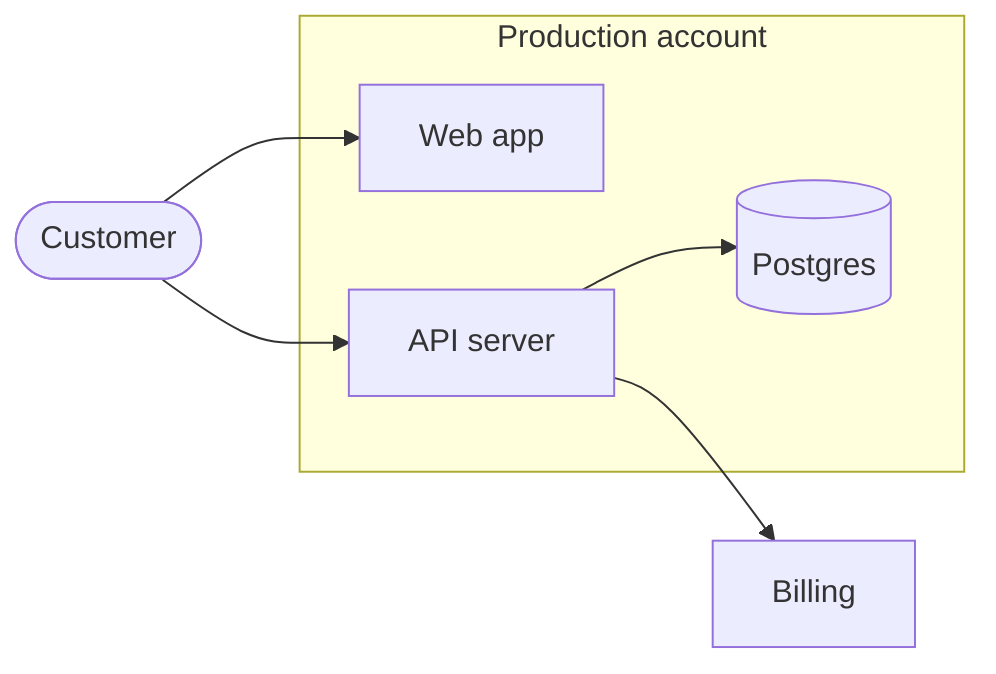
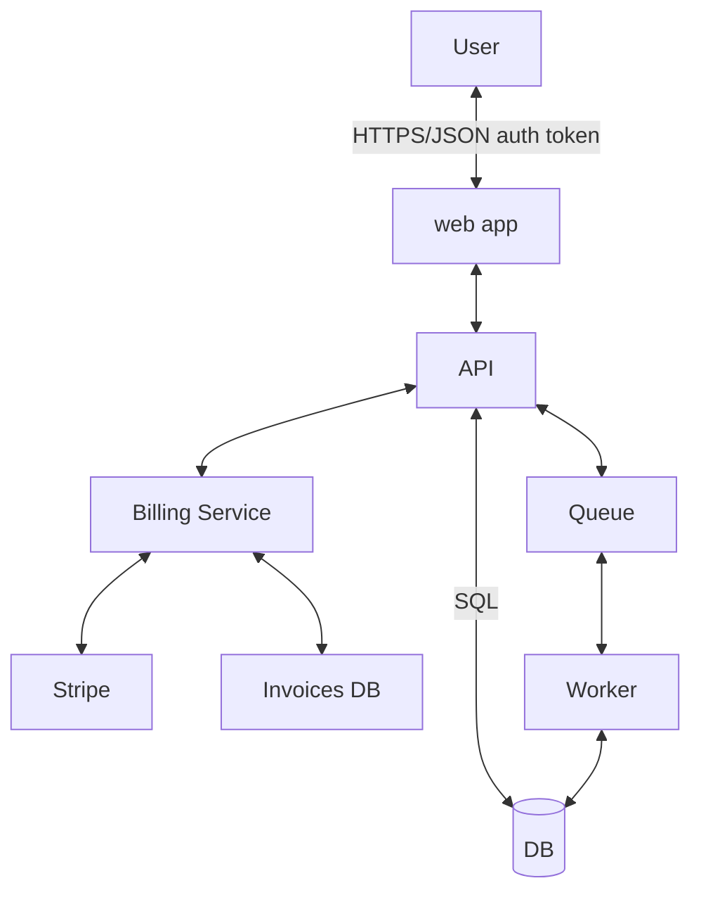

# Mermaid diagrams

A diagram is a zoomed-in piece of one overall map, drawn under prose that explains it. The prose carries the meaning. The diagram shows the shape so a reader can hold it in their head.

Adapted from the [C4 model](https://c4model.com) (zoom levels, consistent notation) and threat-model data flow diagrams (direction of initiation, trust boundaries).

## Rules

1. **One diagram answers one question.** State the question, or the claim the diagram supports, in the sentence right before it. If you can't name the question, don't draw the diagram.
2. **At most 6 boxes and 6 arrows.** Up to 10 boxes is fine when some are nested inside subgraphs. If it doesn't fit, split it into two zoom levels. Never shrink the text or cram it in.
3. **Every box is a bolded term in the prose, and every bolded term is a box.** Use bold only for diagram terms, so a reader can match text to picture in both directions.
4. **Explain connections in prose, never on the arrow.** No arrow labels and no boxes on arrows. Each arrow in the diagram gets a sentence in the prose above that describes it.
5. **Arrows point from caller to callee.** The arrow shows who starts the exchange, which decides the firewall rule, which side authenticates, and where trust is extended. Responses are implied. Use a two-headed arrow (`<-->`) only for true peer links such as replication or a mesh.
6. **Each diagram is a zoomed-in view of the overall map.** Anything outside the zoom is drawn as one collapsed box, and connections go to that box instead of its insides. A collapsed box links to wherever it is expanded.
7. **Use consistent names, in Sentence case.** Always call a thing by the same name, in prose and in every diagram. When a thing has its own page or doc, the box label is that page's title.
8. **Subgraphs are boundaries.** Use a subgraph for something a request crosses: a trust boundary, network, account, or deployment. Label it with what it is ("Customer VPC", "Production account"). Don't use subgraphs for decorative grouping.
9. **Shape shows kind. Nothing else is styled.** Rectangles for services, cylinders for data stores, stadiums for people and external parties. No colors, `classDef` styling, or icons: they break in dark mode and drift between diagrams.
10. **Pick one direction per diagram.** `flowchart LR` for flows, `flowchart TB` for hierarchies. Order boxes so arrows don't cross.

## Mermaid hygiene

- Short, stable node IDs that read as words (`api`, `db`, `worker`), not `A`, `B`, `C`. IDs survive edits; labels change.
- Quote every label: `api["API server"]`. Unquoted parentheses, colons, and slashes break the parser.
- Shapes: `api["API server"]` rectangle, `db[("Postgres")]` cylinder, `user(["Customer"])` stadium.
- Collapsed boxes can link out. In Obsidian, `class billing internal-link;` makes a box labeled with a page title into a wikilink. Elsewhere, `click billing "https://..."` adds a link.
- Render the diagram before committing. A diagram that doesn't parse shows up as a code block.

## Example

The question: what does a customer reach directly? The **Customer** loads the app from the **Web app** and sends API calls to the **API server**, which runs inside the **Production account**. The **API server** reads and writes data in **Postgres**. Billing is out of scope here, so **Billing** is one collapsed box that the **API server** calls to record usage.

Five boxes, four arrows, one boundary. Every box is bold in the prose above, and every arrow has a sentence.

### What the rules prevent

Nine boxes with no boundaries, nine arrows, labels on arrows, two-headed arrows that hide who calls whom, inconsistent casing (`web app`, `Billing Service`), and billing drawn in full when it should be one collapsed box.
